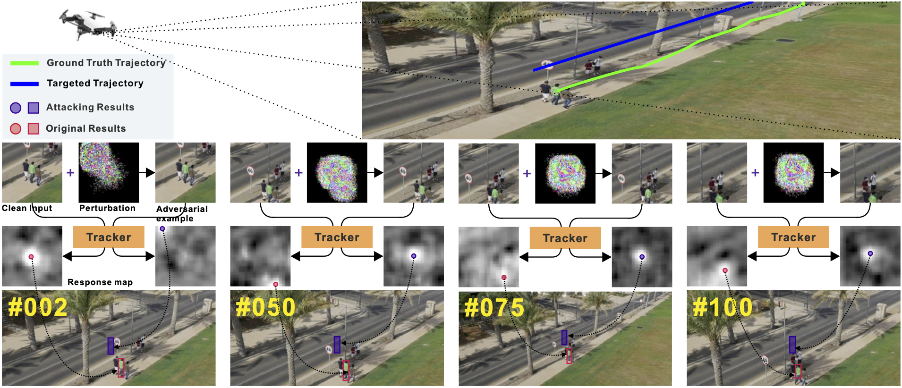

# SPARK

**SPARK** is the first online adversarial attack against visual object tracking: online generating imperceptible perturbations that mislead trackers along with an incorrect (Untargeted Attack, UA) or
specified trajectory (Targeted Attack, TA).

<div align="center">
  
  <p>An example of our adversarial attack to online VOT that drives an UAV [43] to move along the targeted
trajectory (the blue line), which causes divergence from the object moving path (the green line). The perturbations
are enlarged by ×255 for better visualization.</p>
</div>

## Introduction

Adversarial attacks of deep neural networks have been intensively
studied on image, audio, natural language, patch, and pixel classification tasks.
Nevertheless, as a typical while important real-world application, the adversarial
attacks of online video object tracking that traces an object’s moving trajectory
instead of its category are rarely explored. In this paper, we identify a new task for
the adversarial attack to visual tracking: online generating imperceptible perturbations that mislead trackers along with an incorrect (Untargeted Attack, UA) or
specified trajectory (Targeted Attack, TA). To this end, we first propose a spatialaware basic attack by adapting existing attack methods, i.e., FGSM, BIM, and
C&W, and comprehensively analyze the attacking performance. We identify that
online object tracking poses two new challenges: 1) it is difficult to generate imperceptible perturbations that can transfer across frames, and 2) real-time trackers
require the attack to satisfy a certain level of efficiency. To address these challenges, we further propose the spatial-aware online incremental attack (a.k.a.
SPARK) that performs spatial-temporal sparse incremental perturbations online
and makes the adversarial attack less perceptible. In addition, as an optimizationbased method, SPARK quickly converges to very small losses within several iterations by considering historical incremental perturbations, making it much more
efficient than basic attacks. The in-depth evaluation of state-of-the-art trackers
(i.e., SiamRPN++ with AlexNet, MobileNetv2, and ResNet-50, and SiamDW)
on OTB100, VOT2018, UAV123, and LaSOT demonstrates the effectiveness and
transferability of SPARK in misleading the trackers under both UA and TA with
minor perturbations.

## Attacked Trackers

We attack various tracking methods including SiamRPN++ with AlexNet, MobileNet, and Res50, DSiam, MOSSE, KCF, BACF, STRCF, and ECO.

[MOSSE] Bolme, D.S., Beveridge, J.R., Draper, B.A., Lui, Y.M.: Visual object tracking using adaptive
correlation filters. In: CVPR (2010).

[KCF] Henriques, J.F., Caseiro, R., Martins, P., Batista, J.: High-speed tracking with kernelized
correlation filters. IEEE TPAMI 37(3), 583–596 (2015).

[BACF] Galoogahi, H.K., Fagg, A., Lucey, S.: Learning background-aware correlation filters for visual tracking. In: ICCV. pp. 1144–1152 (2017).

[DSaim] Guo, Q., Feng, W., Zhou, C., Huang, R., Wan, L., Wang, S.: Learning dynamic Siamese
network for visual object tracking. In: ICCV. pp. 1781–1789 (2017).

[ECO] Danelljan, M., Bhat, G., Khan, F.S., Felsberg, M.: Eco: Efficient convolution operators for
tracking. In: CVPR. pp. 6931–6939 (2017).

[STRCF] Li, F., Tian, C., Zuo, W., Zhang, L., Yang, M-H.
Learning Spatial-Temporal Regularized Correlation Filters for Visual Tracking.
In: CVPR. pp. 4904-4913 (2018).

[SiamRPN++] Li, B., Wu, W., Wang, Q., Zhang, F., Xing, J., Yan, J.: Siamrpn++: Evolution of siamese
visual tracking with very deep networks. In: CVPR. pp. 4282–4291 (2019)

[SiamDW] Zhang, Z., Peng, H.: Deeper and wider siamese networks for real-time visual tracking. In:
CVPR. pp. 4586–4595 (2019).

## Installation

This work is based on PyTorch and PySOT [https://github.com/STVIR/pysot], pytracking [https://github.com/visionml/pytracking],  and pycftracking.

Please first follow the installation of PySOT. 

### Experimental Scripts

Please follow the bash codes in "./experiments" for the various results in our paper.

## Bibtex

```
@Inproceedings{Guo2020ECCV,
title={SPARK: Spatial-aware Online Incremental Attack Against Visual Tracking},
author={Qing Guo and Xiaofei Xie and Felix Juefei-Xu and Lei Ma and Zhongguo Li and Wanli Xue and Wei Feng and Yang Liu},
booktitle={ECCV},
year={2020},
}
```