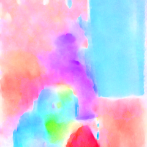
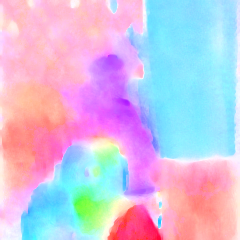

# pytorch-tvnet
This project contains a **simple** and **pytorch** implementation of TVNet in ['End-to-End Learning of Motion Representation for Video Understanding'](http://lijiefan.me/project_webpage/TVNet_cvpr/papers/TVNet_cvpr.pdf) with **pytorch-style**.

- **Simple**: in total ~350 lines of code

- **Pytorch-style**: All modules (central gradient, forward gradient & divergence) extend torch.nn.Module.

The original implementation was in tensorflow, which can be found in https://github.com/LijieFan/tvnet.

# Requirements
- **Python 2.7**: can support python 3.x easily by changing function ```xrange``` to ```range```.

- **pytorch** 

- **matlab (optinonal)**: In the original tensorflow version, authors use `.mat` file for TVNet generated results saving, and `Matlab` for results [`visualization`](http://sintel.is.tue.mpg.de). In the demo code, I also add code for visulizing flow map using cv2 (in python).
 
# Usage
#### I) Put input frames in `frame/img1.png`, `frame/img2.png`.
#### II) Use TVNet to generate motion representation

Sample usages include
- Generate motion representation for frames in `frame/img1.png` and `frame/img2.png`.

```
python demo.py
``` 

#### III) Check results and visualization

-TVNet generated results are saved in `result/result-pytorch.mat`

-For matlab visualization, run ```run visualize/visualize.m```. For python, use code attached at the bottom of ```demo.py```.


# Sample input
<table>
<tr>
<td></td>
<td></td>
</tr>
</table>

# Sample output
<table>
<tr>
<td></td>
<td></td>
</tr>
<tr>
<td>tensorflow implementation</td>
<td>pytorch implementation</td>
</tr>
</table>

# Acknowledgement
Thanks [Huang, Wenbing](https://sites.google.com/site/wenbinghuangshomepage/) for the kindly reply and discussions on the original paper.

# Reference
if you find my code useful for your research, please cite the original paper:

    @inproceedings{fan2018end,
    title={End-to-End Learning of Motion Representation for Video Understanding},
    author={Fan, Lijie and Huang, Wenbing and Gan, Chuang and Ermon, Stefano and Gong, Boqing and Huang, Junzhou},
    booktitle={Proceedings of the IEEE Conference on Computer Vision and Pattern Recognition (CVPR)},
    pages={},
    year={2018}
	}


